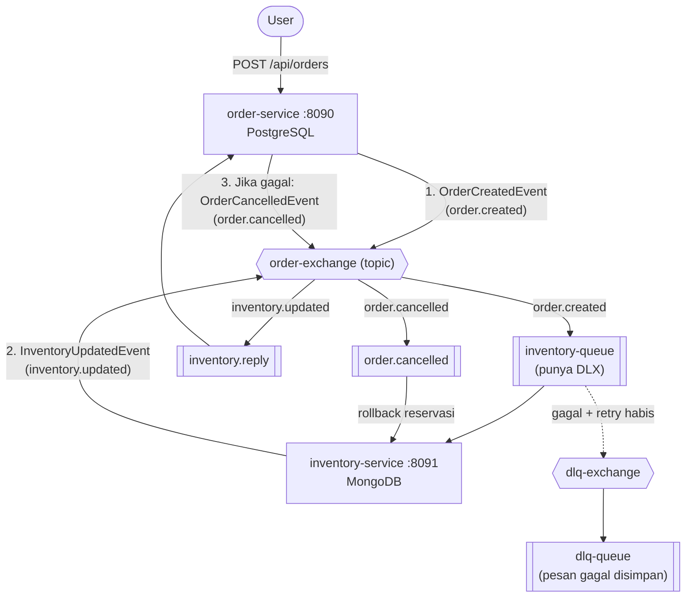
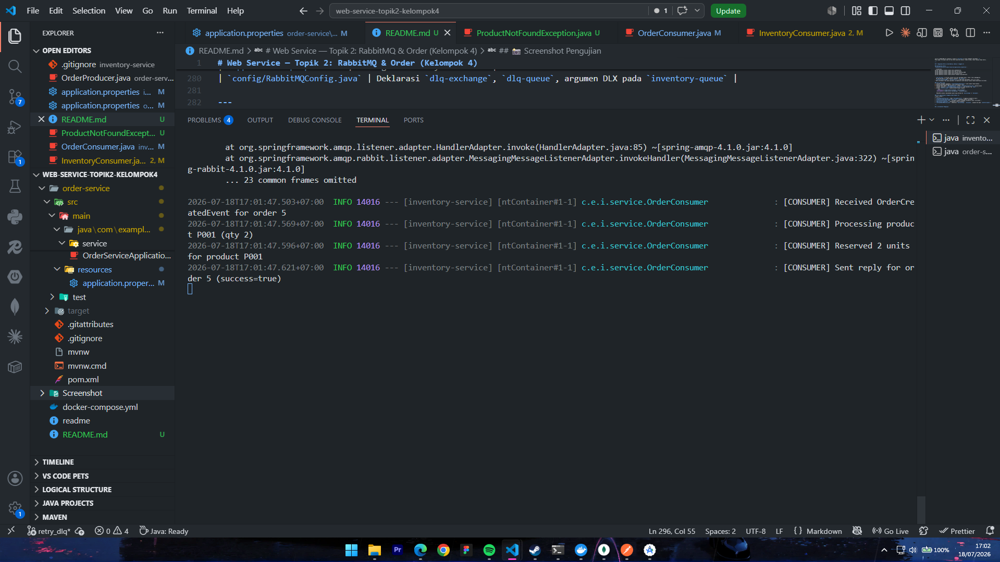
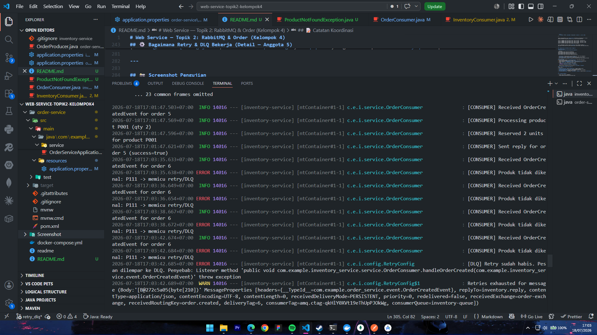
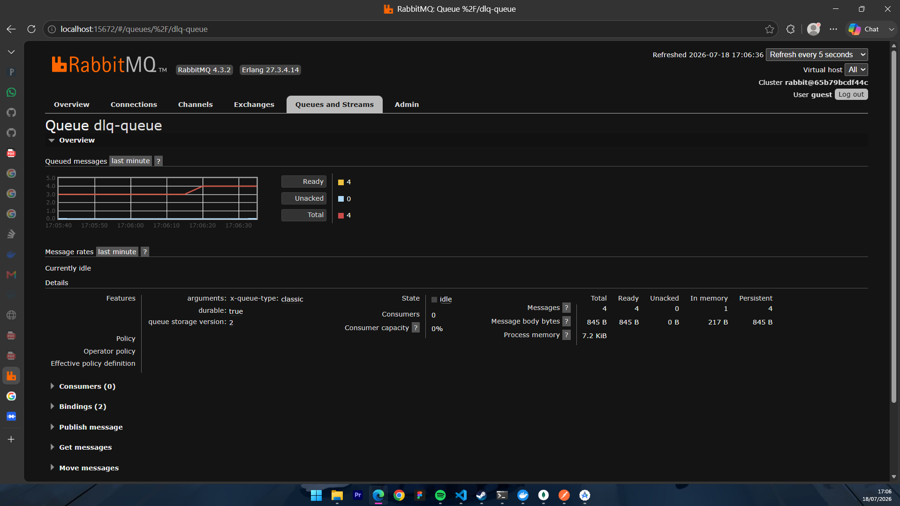

# Web Service — Topik 2: RabbitMQ & Order (Kelompok 4)

Sistem *microservice* sederhana yang mendemonstrasikan komunikasi asinkron antar service
menggunakan **RabbitMQ** dengan pola **Choreography Saga**, lengkap dengan mekanisme
**Retry** dan **Dead Letter Queue (DLQ)**.

Terdiri dari 2 service:

| Service | Port | Database | Peran |
|---|---|---|---|
| `order-service` | `8090` | PostgreSQL (`orderdb`) | Menerima order dari user & mengirim pesan (**Producer**) |
| `inventory-service` | `8091` | MongoDB (`inventorydb`) | Mendengar pesan & memproses stok (**Consumer**) |

---

## 👥 Pembagian Tugas Kelompok

| Anggota | Nama | Tugas |
|---|---|---|
| Anggota 1 | _(isi nama)_ | CRUD Order (PostgreSQL) — 5 endpoint |
| Anggota 2 | _(isi nama)_ | Koneksi RabbitMQ — exchange, queue, binding |
| Anggota 3 | _(isi nama)_ | Producer — kirim pesan ke queue |
| Anggota 4 | _(isi nama)_ | Consumer (Choreography) — listener otomatis + logging |
| Anggota 5 | _(isi nama)_ | **Retry 3x, Dead Letter Queue (DLQ), README & screenshot** |

---

## 🏗️ Arsitektur & Alur Pesan

Semua pesan melewati satu **topic exchange** (`order-exchange`) dan dibedakan oleh **routing key**.



**Alur normal (happy path):**
1. User `POST /api/orders` → `order-service` menyimpan order (status `PENDING`) ke PostgreSQL.
2. `order-service` (Producer) mengirim `OrderCreatedEvent` dengan routing key `order.created`.
3. `inventory-service` (Consumer) menerima pesan, melakukan **reservasi stok**, lalu membalas
   `InventoryUpdatedEvent` (`inventory.updated`).
4. `order-service` menerima balasan → status order menjadi `CONFIRMED`.
5. Jika gagal (stok kurang), `order-service` mengirim `OrderCancelledEvent` (`order.cancelled`)
   → `inventory-service` melakukan **rollback** reservasi (kompensasi saga).

> **Catatan model stok:** sistem memakai pola **reservasi**. Field `quantity` (total stok)
> **tidak berkurang**; yang bertambah adalah `reservedQuantity`. Stok tersedia dihitung
> `quantity - reservedQuantity`.

---

## 📨 Struktur Exchange, Queue & Routing Key

| Exchange | Tipe | Keterangan |
|---|---|---|
| `order-exchange` | topic | Exchange utama untuk semua event |
| `dlq-exchange` | topic | Exchange khusus untuk pesan gagal (DLQ) |

| Queue | Routing key | Fungsi |
|---|---|---|
| `inventory-queue` | `order.created` | Menerima order untuk diproses. Punya argumen `x-dead-letter-exchange` → DLQ |
| `inventory.reply` | `inventory.updated` | Balasan hasil proses inventory ke order-service |
| `order.cancelled` | `order.cancelled` | Perintah rollback reservasi (kompensasi) |
| `dlq-queue` | `inventory.dlq` | **Dead Letter Queue** — penampung pesan yang gagal setelah retry habis |

---

## 🧰 Prasyarat

- **Java 17** & **Maven** (sudah tersedia via `mvnw` di tiap folder, tidak perlu install manual)
- **Docker Desktop** (untuk menjalankan RabbitMQ)
- **PostgreSQL** (instalasi lokal, port `5432`) — untuk `order-service`
- **Koneksi internet** — `inventory-service` memakai **MongoDB Atlas** (cloud), tidak perlu install MongoDB lokal

---

## 🚀 Cara Menjalankan

Jalankan komponen berikut secara berurutan. Perintah menggunakan **PowerShell (Windows)**.

### 1) Jalankan RabbitMQ (Docker)

```powershell
docker run -d --name rabbitmq -p 5672:5672 -p 15672:15672 rabbitmq:4-management
```

- Port `5672` = koneksi aplikasi, port `15672` = Management UI.
- Buka Management UI: **http://localhost:15672** — login `guest` / `guest`.

> Jika muncul error `failed to connect to the docker API`, berarti **Docker Desktop belum
> berjalan**. Buka aplikasi Docker Desktop dulu, tunggu sampai statusnya "running", lalu ulangi.

### 2) Jalankan MongoDB (Docker Compose)

`inventory-service` terhubung ke **MongoDB lokal** (`mongodb://localhost:27017/inventorydb`).
Jalankan MongoDB memakai `docker-compose.yml` yang sudah tersedia di folder root:

```powershell
docker compose up -d

Saat `inventory-service` pertama kali start, data stok awal akan otomatis di-*seed*
(jika koleksi masih kosong):

| productId | Nama | quantity |
|---|---|---|
| `P001` | Laptop | 50 |
| `P002` | Mouse | 100 |
| `P003` | Keyboard | 30 |
| `P004` | Monitor | 20 |

### 3) Siapkan PostgreSQL

Pastikan PostgreSQL lokal berjalan (port `5432`), lalu buat database `orderdb`:

```powershell
& "C:\Program Files\PostgreSQL\18\bin\psql.exe" -h localhost -U postgres -c "CREATE DATABASE orderdb;"
```

> Sesuaikan angka versi (`18`) dan **password** dengan instalasi PostgreSQL kamu.
> Kredensial default yang dipakai aplikasi ada di
> `order-service/src/main/resources/application.properties`
> (`username=postgres`, `password=123`). Ubah jika berbeda. Tabel dibuat otomatis
> (`spring.jpa.hibernate.ddl-auto=update`).

### 4) Jalankan `inventory-service` (Terminal 1)

```powershell
cd inventory-service
.\mvnw.cmd spring-boot:run
```

Berhasil jika muncul `Started InventoryServiceApplication` di port **8091**.

### 5) Jalankan `order-service` (Terminal 2)

```powershell
cd order-service
.\mvnw.cmd spring-boot:run
```

Berhasil jika muncul `Started OrderServiceApplication` di port **8090**.

Setelah keduanya jalan, buka RabbitMQ UI → tab **Queues and Streams** → keempat queue
(`inventory-queue`, `inventory.reply`, `order.cancelled`, `dlq-queue`) akan muncul.

---

## 🔌 Daftar Endpoint (order-service)

Base URL: `http://localhost:8090`

| Method | Endpoint | Fungsi |
|---|---|---|
| `POST` | `/api/orders` | Buat order baru (memicu pesan ke RabbitMQ) |
| `GET` | `/api/orders` | Ambil semua order |
| `GET` | `/api/orders/{id}` | Ambil order berdasarkan id |
| `PUT` | `/api/orders/{id}` | Ubah order |
| `DELETE` | `/api/orders/{id}` | Hapus order |

Contoh body `POST /api/orders`:

```json
{
  "customerName": "Budi",
  "customerEmail": "budi@mail.com",
  "items": [
    { "productId": "P001", "productName": "Laptop", "quantity": 1, "price": 15000000 }
  ]
}
```

---

## 🧪 Pengujian

Gunakan **Postman** (atau curl). Method `POST`, URL `http://localhost:8090/api/orders`,
Body → **raw → JSON**.

### ✅ Skenario 1 — Order Normal (Happy Path)

Kirim order dengan produk yang **ada** (`P001`):

```json
{
  "customerName": "Budi",
  "customerEmail": "budi@mail.com",
  "items": [
    { "productId": "P001", "productName": "Laptop", "quantity": 2, "price": 15000000 }
  ]
}
```

**Hasil yang diharapkan** — log `inventory-service`:
```
[CONSUMER] Received OrderCreatedEvent for order X
[CONSUMER] Reserved 2 units for product P001
[CONSUMER] Sent reply for order X (success=true)
```
- Response Postman: `201 Created`, status awal `PENDING`.
- Beberapa saat kemudian status menjadi `CONFIRMED` (cek `GET /api/orders/X`).
- Di MongoDB, `reservedQuantity` produk P001 bertambah (klik refresh untuk melihat).

### 🔁 Skenario 2 — Retry 3x + Dead Letter Queue (DLQ) ⭐

Kirim order dengan produk yang **tidak ada di katalog** (mis. `P999`) untuk memicu kegagalan:

```json
{
  "customerName": "Siti",
  "customerEmail": "siti@mail.com",
  "items": [
    { "productId": "P999", "productName": "Barang Hantu", "quantity": 1, "price": 1000 }
  ]
}
```

**Hasil yang diharapkan** — log `inventory-service` menunjukkan **1 percobaan awal + 3 retry**
dengan jeda membesar (*exponential backoff* 1s → 2s → 4s), lalu pesan masuk DLQ:

```
16:33:23  [CONSUMER] Produk tidak dikenal: P111 -> memicu retry/DLQ   (percobaan awal)
16:33:24  [CONSUMER] Produk tidak dikenal: P111 -> memicu retry/DLQ   (retry ke-1, +1 dtk)
16:33:26  [CONSUMER] Produk tidak dikenal: P111 -> memicu retry/DLQ   (retry ke-2, +2 dtk)
16:33:30  [CONSUMER] Produk tidak dikenal: P111 -> memicu retry/DLQ   (retry ke-3, +4 dtk)
16:33:30  [DLQ] Retry sudah habis. Pesan dilempar ke DLQ. Penyebab: ...
```

Lalu di **RabbitMQ UI → Queues** → queue **`dlq-queue`** kolom **Ready** bertambah `+1`.
Pesan gagal tersimpan aman di DLQ untuk diperiksa manual (tidak hilang, tidak looping tanpa henti).

---

## ⚙️ Bagaimana Retry & DLQ Bekerja (Detail — Anggota 5)

### Konfigurasi Retry
`inventory-service/src/main/resources/application.properties`:

```properties
spring.rabbitmq.listener.simple.retry.enabled=true
spring.rabbitmq.listener.simple.retry.max-retries=3
spring.rabbitmq.listener.simple.retry.initial-interval=1000
spring.rabbitmq.listener.simple.retry.multiplier=2.0
spring.rabbitmq.listener.simple.default-requeue-rejected=false
```

- `max-retries=3` → **3 kali retry** (di luar percobaan awal), total 4 kali pemanggilan.
  (Di Spring Boot 4.x nama properti resminya `max-retries`.)
- `initial-interval=1000` + `multiplier=2.0` → jeda antar percobaan: **1s → 2s → 4s**.
- Retry dilakukan **di dalam aplikasi (in-memory)** oleh Spring — pesan tidak bolak-balik ke broker.

### Alur menuju DLQ
1. Consumer melempar exception (`ProductNotFoundException`) saat produk tidak dikenal.
2. Spring mengulang pemanggilan sesuai konfigurasi retry.
3. Setelah retry habis, `MessageRecoverer` (lihat `config/RetryConfig.java`) menolak pesan
   **tanpa requeue** (`RejectAndDontRequeueRecoverer`) dan mencatat log `[DLQ] ...`.
4. Karena `inventory-queue` dideklarasikan dengan argumen:
   ```java
   .withArgument("x-dead-letter-exchange", "dlq-exchange")
   .withArgument("x-dead-letter-routing-key", "inventory.dlq")
   ```
   RabbitMQ otomatis memindahkan pesan yang ditolak ke `dlq-exchange` → `dlq-queue`.

### File yang menjadi tanggung jawab bagian ini
| File | Peran |
|---|---|
| `config/RetryConfig.java` | Bean `MessageRecoverer` — logging & handoff ke DLQ |
| `exception/ProductNotFoundException.java` | Exception pemicu retry/DLQ |
| `service/OrderConsumer.java` | Validasi produk → melempar exception (jalur retry/DLQ) |
| `application.properties` | Konfigurasi retry & backoff |
| `config/RabbitMQConfig.java` | Deklarasi `dlq-exchange`, `dlq-queue`, argumen DLX pada `inventory-queue` |

---

## 📸 Screenshot Pengujian

1. **Order normal berhasil (CONFIRMED)**
   

2. **Log Retry 3x dan pesan masuk DLQ (`[DLQ] Retry sudah habis...`)**
   

3. **RabbitMQ UI — `dlq-queue` berisi pesan gagal**
   

---
